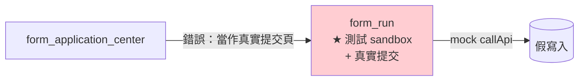
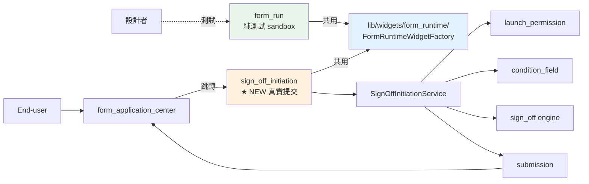
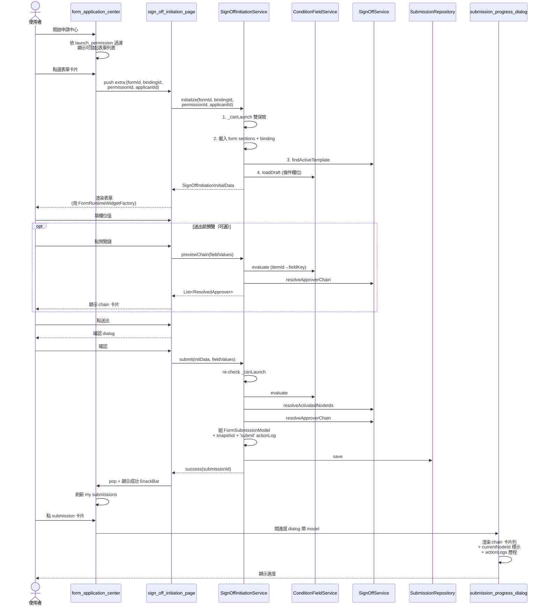

# 發起簽核 (sign_off_initiation) 模組規劃

> 對應 P2 階段：打通 end-user「填表 → 送出 → 凍結 sign_off chain → 寫入 submission → 看進度」端到端流程。
>
> 相關文件：[sign_off_implementation_status.md](sign_off_implementation_status.md)（Phase A/B 對照）、[form_condition_field_planning.md](form_condition_field_planning.md)、[form_permission_planning.md](form_permission_planning.md)

---

## 1. Context

### 職責釐清（本規劃的核心修正）

| 模組 | 原本（誤解） | 修正後（本規劃） |
|---|---|---|
| `form_run` | 兼當「設計者測試」與「真實提交」 | **純測試 sandbox** — 給設計者驗證 form_data_binding / form_action_binding 設定正確；不寫真實 submission |
| `form_application_center` | 跳 `form_run` 當作申請頁 | 跳新模組 `sign_off_initiation` |
| **`sign_off_initiation`（新）** | — | end-user 真實提交流程，整合 launch_permission / condition_field / sign_off / submission |

### 為什麼獨立成模組

- 測試與真實提交需求分歧：測試需要 mock callApi、navigate-only action、可重複執行；真實申請需要寫 submission、凍結 sign_off chain、發起資格雙保險
- 兩個職責塞進 `form_run` 會讓 sandbox 變得複雜、汙染測試行為
- 獨立模組便於對 end-user UX 最佳化（送出前確認 dialog、進度提示、錯誤處理），不會卡到設計者測試流程

### 端到端流程

使用者於申請中心選表單 → 跳新模組 `sign_off_initiation` → 渲染表單 + 填值 → 送出 → 凍結 sign_off chain + 寫入 submission → 跳回申請中心 → 我的申請看到進度

### 範圍刻意排除

approver 動作（同意/拒絕/退回）、待辦列表、會簽收斂、SLA 計時 — 屬於 P3+。本次只做凍結 + 寫入 + 進度查詢。

---

## 2. 模組職責切分（改動前後對比）

### 改前（職責混淆）


### 改後（職責分離）


---

## 3. 整體執行流程



### 資料流（key 對應）

```
sign_off_initiation.state.fieldValues : Map<itemId, FormRunFieldValue>
                                          │
                                          │ 取 effectiveValue
                                          ↓
                       Map<itemId, String> ──→ ConditionFieldService.evaluate(formId)
                                                                            │
                                                Map<fieldKey, value>  ──────┘
                                                                            │
                                                                            ↓
                                              SignOffService.resolveActivatedNodeIds
                                                                            │
                                              SignOffService.resolveApproverChain (async)
                                                                            │
                                                                            ↓
                                                           List<ResolvedApprover> + Set<nodeId>
                                                                            │
                                                                            ↓
                                                                FormSubmissionModel
                                                                  ├── activatedNodeIds
                                                                  ├── approverChainSnapshot
                                                                  ├── currentNodeId
                                                                  ├── status='in_progress'
                                                                  └── actionLogs[0]='submit'
```

---

## 4. 改動清單

### 改動分類總覽

| 類型 | 數量 | 範圍 |
|---|---|---|
| 🆕 新增 | 11 檔 | 新模組（service / page / bloc / 4 widgets / progress dialog）+ 抽出共用 widget 3 檔 |
| ✏️ 修改 | 7 檔 | model / service / DI / route / center bloc / center widget / form_run import |
| ➖ 廢棄 | 1 區塊 | `FormApplicationService.submitForm`（保留兼容，後續清理） |
| 🚫 不動 | form_run 全部 | BLoC / Page / submitForm action 行為完全保留 |

### 新增檔案

#### 整合層（1）
| 檔案 | 職責 |
|---|---|
| `lib/service/sign_off_initiation_service.dart` | 整合 launch_permission + condition_field + sign_off + submission；3 個對外方法：`initialize` / `previewChain` / `submit` |

#### sign_off_initiation 模組（8）
| 檔案 | 職責 |
|---|---|
| `lib/page/sign_off/sign_off_initiation/sign_off_initiation_page.dart` | Scaffold + BlocProvider |
| `bloc/sign_off_initiation_bloc.dart` | 8 個 events |
| `bloc/sign_off_initiation_event.dart` | Init / FieldChanged / PreviewChain / Dismiss / Submit / Confirm / Cancel / DismissMsg |
| `bloc/sign_off_initiation_state.dart` | status / draft / template / fieldValues / chainPreview / submissionId / message |
| `widgets/initiation_header_widget.dart` | title + 流程資訊 chip + 預覽 / 送出按鈕 |
| `widgets/initiation_form_body_widget.dart` | section 列表 + `FormRuntimeWidgetFactory` 渲染欄位 |
| `widgets/initiation_chain_card_widget.dart` | 簽核鏈卡片列（送出前預覽 + 送出後進度共用） |
| `widgets/initiation_confirm_dialog.dart` | 送出前最終確認 dialog |

#### 申請中心進度檢視（1）
| 檔案 | 職責 |
|---|---|
| `lib/page/form_design/form_application_center/widgets/submission_progress_dialog.dart` | 點 my submissions 卡片開的進度 dialog |

#### 共用渲染 widget（3，從 form_run 抽出）
| 新位置 | 來源 |
|---|---|
| `lib/widgets/form_runtime/form_runtime_widget_factory.dart` | 從 `lib/page/form_design/form_run/widgets/form_run_widget_factory.dart` 搬出 |
| `lib/widgets/form_runtime/form_runtime_text_field_widget.dart` | 同上 rename |
| `lib/widgets/form_runtime/form_runtime_dropdown_widget.dart` | 同上 rename |

### 修改檔案

| 檔案 | 改動 |
|---|---|
| `lib/model/form_submission_model.dart` | 加 5 欄位：`signOffTemplateId / activatedNodeIds / approverChainSnapshot / currentNodeId / actionLogs`；status 字串擴充 |
| `lib/service/sign_off_service.dart` | 加 helper `findActiveTemplate(formId)` |
| `lib/injection/dependency_injection.dart` | 註冊 `SignOffInitiationService` + `SignOffInitiationBloc` |
| `lib/route/app_router.dart` | 加 `RouteName.signOffInitiationPage = '/home/sign-off/initiate'` + GoRoute |
| `lib/page/form_design/form_application_center/bloc/form_application_center_bloc.dart` | `_onSelectFormToApplyEvent` 路由改 `signOffInitiationPage`，extra 補 `permissionId` + `applicantId` |
| `lib/page/form_design/form_application_center/widgets/application_submission_section_widget.dart` | submission 卡片加 onTap → 開進度 dialog |
| `lib/page/form_design/form_run/widgets/form_run_*_widget.dart` 共 3 檔 | 移除（內容已搬出至 `lib/widgets/form_runtime/`），剩餘 form_run widgets（body/section）import 改指向新路徑 |

### 不動 / 廢棄

- `form_application_service.dart` 的 `submitForm` 變成 dead code — 暫時留著兼容性，後續清理時直接刪
- form_run BLoC / state / page — 完全不動，只動 widget import

---

## 5. 解決方案細節

### 5.1 擴充 FormSubmissionModel

[lib/model/form_submission_model.dart](../../lib/model/form_submission_model.dart) 加 sign_off snapshot 欄位：

```dart
class FormSubmissionModel {
  // ... 既有欄位 ...

  /// 對應的 sign_off template ID（提交當下 active 模板）。
  /// 空 = 此表單無啟用簽核流程，純記錄。
  final String signOffTemplateId;

  /// path rules 評估後啟用的 nodeId 集合。
  final List<String> activatedNodeIds;

  /// 凍結的簽核鏈快照（List<ResolvedApprover> 序列化為 List<Map>）。
  final List<Map<String, dynamic>> approverChainSnapshot;

  /// 目前推進到的 nodeId（提交時 = applicant origin nodeId）。
  final String currentNodeId;

  /// 動作歷程 append-only。提交時寫入第一筆 'submit'。
  final List<Map<String, dynamic>> actionLogs;
}
```

**status 擴充**：
- `submitted_no_flow` — 無 sign_off template，純記錄
- `in_progress` — 流程進行中（P2 預設此值）
- `approved` / `rejected` / `returned` / `cancelled` — 留給 P3

actionLog 結構（記在 submission JSON 內，不獨立成 model）：
```dart
{
  'logId': 'log_<microsec>',
  'nodeId': '<source node ID>',
  'action': 'submit',  // 'submit' / 'approve' / 'reject' / 'return' / 'comment'
  'actorId': '<employeeId>',
  'actorName': '<employeeName>',
  'comment': '',
  'timestamp': '<ISO8601 UTC>',
}
```

### 5.2 SignOffInitiationService

新檔 [lib/service/sign_off_initiation_service.dart](../../lib/service/sign_off_initiation_service.dart)：

```dart
class SignOffInitiationInitialData {
  final FormDataBindingDraft draft;          // 表單區塊 + 欄位
  final SignOffTemplateModel? template;      // active 簽核模板（可能 null）
  final ConditionFieldDraft? conditionDraft; // 條件欄位 draft（可能 null）
  final FormLaunchPermissionModel permission;
  final EmployeeModel applicant;
}

class SignOffInitiationService {
  final FormRepository _formRepository;
  final SectionRepository _sectionRepository;
  final FormDataBindingRepository _bindingRepository;
  final FormLaunchPermissionRepository _permissionRepository;
  final EmpInfoRepository _empInfoRepository;
  final ConditionFieldService _conditionFieldService;
  final SignOffService _signOffService;
  final FormSubmissionRepository _submissionRepository;

  /// 1. 初始化頁面：載入表單結構 + 綁定 + 條件欄位 + 簽核模板 + 雙保險權限驗證
  Future<Result<SignOffInitiationInitialData>> initialize({
    required String formId,
    required String bindingId,
    required String permissionId,
    required String applicantId,
  });

  /// 2. 即時預覽簽核鏈（送出前確認用，不寫資料）
  Future<Result<List<ResolvedApprover>>> previewChain({
    required SignOffTemplateModel template,
    required String applicantId,
    required Map<String, String> fieldValuesById,
    required String formId,
  });

  /// 3. 真實送出：condition evaluate → sign_off resolve → 寫 submission snapshot
  Future<Result<FormSubmissionModel>> submit({
    required SignOffInitiationInitialData initData,
    required Map<String, String> fieldValuesById,
  });

  // 內部
  bool _canLaunch(EmployeeModel emp, FormLaunchPermissionModel perm);
  Map<String, dynamic> _serializeApprover(ResolvedApprover r);
}
```

**SignOffService 新增 helper**：
[lib/service/sign_off_service.dart](../../lib/service/sign_off_service.dart) 加 `findActiveTemplate(formId)` — 取最新 status='active' 的模板。

### 5.3 sign_off_initiation 模組結構

```
lib/page/sign_off/sign_off_initiation/
├── sign_off_initiation_page.dart          ─ Scaffold + BlocProvider
├── bloc/
│   ├── sign_off_initiation_bloc.dart
│   ├── sign_off_initiation_event.dart     ─ 8 events
│   └── sign_off_initiation_state.dart
└── widgets/
    ├── initiation_header_widget.dart      ─ title + 流程資訊 chip + 預覽 / 送出
    ├── initiation_form_body_widget.dart   ─ ListView + 各 section + FormRuntimeWidgetFactory
    ├── initiation_chain_card_widget.dart  ─ 鏈卡片列（預覽 + 進度共用）
    └── initiation_confirm_dialog.dart     ─ 送出前確認
```

**Bloc events**：
```dart
- InitInitiationEvent(formId, bindingId, permissionId, applicantId)
- UpdateFieldValueEvent(itemId, value)
- RequestPreviewChainEvent
- DismissPreviewChainEvent
- RequestSubmitEvent          // 觸發確認 dialog
- ConfirmSubmitEvent           // dialog 按確認後實際 submit
- DismissMessageEvent
- CancelInitiationEvent        // 返回前確認（若已填資料）
```

**Bloc state**：
```dart
class SignOffInitiationState {
  final SignOffInitiationStatus status;  // initial / loading / ready / submitting / submitted / failure
  final FormDataBindingDraft draft;
  final SignOffTemplateModel? template;
  final ConditionFieldDraft? conditionDraft;
  final FormLaunchPermissionModel permission;
  final EmployeeModel applicant;
  final Map<String, String> fieldValues;  // itemId-keyed
  final List<ResolvedApprover>? chainPreview;
  final String? completedSubmissionId;     // 成功時帶出
  final String message;
}
```

### 5.4 抽共用 form-runtime widget

新位置 `lib/widgets/form_runtime/`：
- `form_runtime_widget_factory.dart` — 從 [form_run_widget_factory.dart](../../lib/page/form_design/form_run/widgets/form_run_widget_factory.dart) 搬出 + rename `FormRunWidgetFactory` → `FormRuntimeWidgetFactory`
- `form_runtime_text_field_widget.dart` — 同上 rename
- `form_runtime_dropdown_widget.dart` — 同上 rename
- `_FormRuntimeDatePickerWidget` — internal

**form_run 沿用**：改 import 路徑；BLoC + Page 結構不變
**`FormRunBodyWidget` / `FormRunSectionWidget`** 留在 form_run 下（屬於 form_run 的版面 widgets，不適合共用）
**sign_off_initiation 使用**：`InitiationFormBodyWidget` 內部呼叫 `FormRuntimeWidgetFactory.buildInteractiveWidget(...)`

### 5.5 申請中心整合

`form_application_center_bloc._onSelectFormToApplyEvent` 改：
```dart
emit(state.copyWith(
  navigateRoute: RouteName.signOffInitiationPage,  // ← 改路由
  navigateExtra: {
    'formId': event.formId,
    'bindingId': event.bindingId,
    'permissionId': event.permissionId,           // ← 新增
    'applicantId': state.employeeId,              // ← 新增
  },
));
```

`application_submission_section_widget.dart` — submission 卡片加 onTap 開進度 dialog。

進度 dialog 視覺：
```
┌─ 申請進度 ── 請假表單 ─ #sub_1234567 ──── X ─┐
│ 狀態：流程進行中（in_progress）              │
│ 提交時間：2026-05-07 14:30                   │
│                                              │
│ ▎簽核鏈（5 關，目前在 #2）                   │
│  #1 ✅ 申請起點：王小明                       │
│  #2 🔵 此部門主管：林主管 ← 目前在此           │
│  #3 ⚪ 此部門主管：張總                       │
│  #4 ⚪ 指定角色：HR ─ HR_主管                 │
│  #5 ⚪ 此部門主管：總經理                     │
│                                              │
│ ▎歷程（1 筆）                                │
│  • 2026-05-07 14:30  王小明  提交申請        │
└──────────────────────────────────────────────┘
```

### 5.6 路由

[lib/route/app_router.dart](../../lib/route/app_router.dart) 加：
```dart
class RouteName {
  static const String signOffInitiationPage = '/home/sign-off/initiate';
}

GoRoute(
  path: 'initiate',
  builder: (context, state) {
    final extra = state.extra as Map<String, dynamic>;
    return SignOffInitiationPage(
      formId: extra['formId'] as String? ?? '',
      bindingId: extra['bindingId'] as String? ?? '',
      permissionId: extra['permissionId'] as String? ?? '',
      applicantId: extra['applicantId'] as String? ?? '',
    );
  },
),
```

放在 `signOffManagerPage` 兄弟路由下。

---

## 6. 階段切分

每階段獨立可編譯且各自有驗證點：

### S1 — Model + Service 純資料層
1. `FormSubmissionModel` 加 5 欄位 + 序列化
2. `SignOffService.findActiveTemplate(formId)`
3. `SignOffInitiationService` 完整實作（initialize + previewChain + submit）
4. DI 註冊
5. **驗證**：寫測試或 main 餵假資料 → 看 LocalStorage 寫入 snapshot 正確

### S2 — Widget 抽出
6. 把 form_run_widget_factory.dart 等 3 檔搬到 `lib/widgets/form_runtime/`，class rename
7. form_run 改 import 路徑
8. **驗證**：form_run 跑起來與之前一致

### S3 — sign_off_initiation 模組
9. Bloc / Event / State
10. Page 主框架 + BlocProvider
11. 4 個 widget（header / form body / chain card / confirm dialog）
12. 路由 + DI
13. **驗證**：手動跳 `RouteName.signOffInitiationPage` extra:{formId, ...} 能載入並渲染表單

### S4 — 申請中心整合
14. application_center BLoC navigateExtra 補欄位 + 路由改點
15. submission 卡片 onTap 開進度 dialog
16. 進度 dialog widget
17. **驗證**：申請中心 → 選表單 → 跳新頁 → 填值 → 預覽鏈 → 送出 → 返回看到我的申請

---

## 7. 驗證方式

1. **編譯**：`flutter analyze --no-pub lib/` → 0 errors
2. **form_run 不變**：開 form_run 測試表單，與改版前體感一致（純測試 sandbox）
3. **無 sign_off template 表單**：
   - 建表單 + launch_permission，**不**建 sign_off template
   - 申請中心 → 跳 sign_off_initiation → 填值 → 送出
   - 預期 status='submitted_no_flow'，進度 dialog 顯示「此表單無簽核流程」
4. **單純 sign_off 流程（無 path rules）**：
   - 建請假流程 5 關，無 path rules
   - 申請中心 → 跳 initiation → 填值 → 預覽 chain → 送出
   - LocalStorage 看 submission：activatedNodeIds=4 個非起點節點、approverChainSnapshot=5 筆
5. **完整 path rules + condition_field**：
   - 用 `leave_days = DateDiff(start, end)` + 短假 / 中假 / default 三條 rules
   - 試三種輸入：1 / 15 / 60 天 → activatedNodeIds 數量不同
   - 與 sign_off editor 的「規則預覽」結果一致
6. **launch_permission 雙保險**：
   - 申請中心進入後，後台改 permission 把申請人剔除
   - 點送出 → 預期失敗訊息「發起資格不符」
7. **未解析 chain 容錯**：
   - 設一個 sign_off node 的部門無主管
   - 送出：預期能正常寫入 submission，approverChainSnapshot 內該節點 resolved=false
   - 進度 dialog 顯示該節點為「⚠ 未解析」
8. **取消返回**：
   - 進入 initiation 填部分值 → 按返回 → 確認 dialog → 取消提交無資料寫入

---

## 8. 風險與已知限制

1. **form_runtime widget 抽出可能讓 form_run import 大量改變** — 但純路徑 rename，行為不變；務必跑一次 form_run 測試
2. **SignOffInitiationService 注入鏈長**（8 個依賴）— 可接受，因為這是整合層
3. **`approverChainSnapshot` 用 `List<Map>` 非強型別** — 為 LocalStorage JSON 序列化方便；P3 動作機制需要時可加 `SubmissionApproverSnapshotModel` 強型別
4. **多 active template 衝突** — `findActiveTemplate` 取最新 updatedAt；應在 sign_off editor 加 only-one-active 約束（本次不做）
5. **`form_application_service.submitForm` 變成 dead code** — 暫時留著兼容性；後續清理時直接刪
6. **進度 dialog 純讀 snapshot 不重新解析** — 故意設計：snapshot 凍結後就是稽核依據，組織異動後重解析會偏離凍結時點，違反「歷程不可變」原則

---

## 9. 不在本次範圍

| 項目 | 對應階段 |
|---|---|
| approver 動作（同意 / 拒絕 / 退回 / 補件 / 加簽 / 轉派） | P3 |
| 我的待辦頁（簽核人視角） | P3 |
| 會簽收斂（multiStrategy） | P3 |
| 知會節點派發 | P3 |
| SLA 計時 / 過期通知 | P4 |
| 後端 API 對接 | P5 |
| launch_permission 條件組合（AND/OR） | 後續評估 |
| launch_permission bindingId 啟用 | 後續評估 |
| form_run 行為變動 | 不動 |
